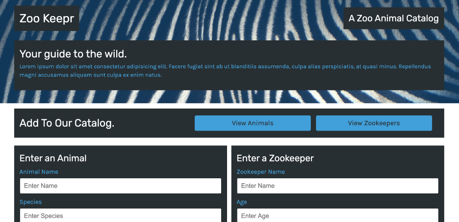

# Zookeepr
    
## Description 
View a catalog of zoo animals with various traits along with a current directory of Zookeepers. The online catalog is serviced through back-end servers. 

## Table of Contents 
* [Installation](#installation)
* [Usage](#usage)
* [Credits](#credits)
* [License](#license)

## Installation 
Git clone the repository to your local computer. Through the command line, you must install npm Jest and Express Js through Node JS. You must also download Heroku to host the server-side website. The online catalog can only be viewed through Heroku because of the back-end server. When all licenses have been installed through the command line, to make the webpage viewable, you must type "npm start" in the command line. Then type "heroku open". 

## Usage 
Once the webpage is opened and viewable in the Heroku cloud application, you can interact with the Zoopkeepr catalog by searching animals/zookeepers. 

    
## Credits 
UofA Coding Bootcamp (creator)

## License 
Node.Js, NPM Jest, Express JS, Heroku

---
🏆 
## Badges

## Contributing 
If there are any future open issues, click on the issues tab to contribute. There are currently no open issues.

## Tests 
Test files are built into this application, and to run the tests, in command line type in "npm run test" 